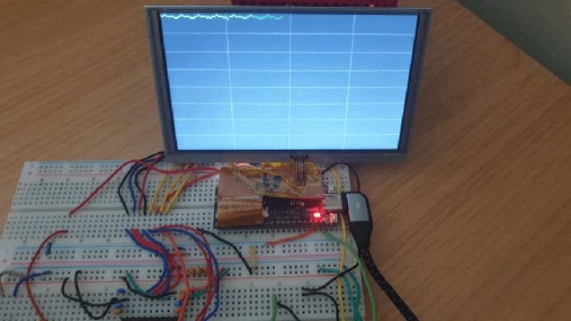

# oscilloscope-fpga
Simple oscilloscope on a GW1N-1 FPGA using VHDL. The measured voltage signal is read using a 8-bit flash ADC which is controlled by the `adc_controller` component and then written into the frame buffer. The contents of the frame buffer are then read by the `vga_controller`, which drives the 5" VGA LCD display.

## Top Level System Diagram

